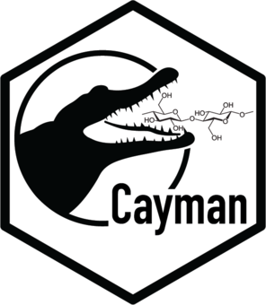

======
Cayman (<ins>C</ins>arbohydrate <ins>a</ins>ctive enz<ins>y</ins>mes profiling of <ins>m</ins>et<ins>a</ins>ge<ins>n</ins>omes) is a command-line profiling tool for profiling CAZyme abundances in metagenomic datasets. It takes as input (preferably) cleaned -- quality-filtered and host-filtered -- metagenomic shotgun reads and produces a matrix of CAZyme
Reads-Per-Kilobase-Million (RPKM) abundances for your sample. Cayman makes heavy use of the functional profiling library [`gqlib`](https://github.com/cschu/gqlib).

### Prerequisites

#### Dependencies
  - python>=3.7,<3.11
  - bwa

  The following python libraries need to be installed
  - numpy
  - pandas
  - pysam
  - intervaltree
  - gqlib>=2.14.3 (which should take care of all python library requirements)

  You will need a `bwa` installation. One way -- if you didn't install `cayman` via bioconda or if you're not using a container -- would be to use `conda env create -f environment.yml` using the provided [environment.yml](environment.yml).

  #### Metagenomics reference datasets and CAZyme catalogues

  Cayman uses prevalence-filtered reference data sets from the [Global Microbial Gene Catalog (GMGC)](https://gmgc.embl.de/). We annotated these datasets with our dedicated CAZyme annotation method (cf. [Ducarmon & Karcher et al.](https://www.biorxiv.org/content/10.1101/2024.01.08.574624v1)). The filtered GMGC datasets and their CAZyme annotations can be downloaded from [Zenodo](https://zenodo.org/records/10473258).

  [TABLE]

  Prior to your first profiling run, you will have to build a bwa index from the respective GMGC reference dataset.

  ```
  bwa index -p <index_name> [-b blocksize] /path/to/dataset
  ```

  If you have enough memory available, setting `-b` to a higher value than the default (`10,000,000`), e.g. `100,000,000`, [may speed up the index generation](https://github.com/lh3/bwa/issues/104).


## Installation
Cayman can most easily be installed via

  - [bioconda]() tbd
  - [PyPI](https://pypi.org/project/cayman/) (you still require your own `bwa` installation)
  - [Docker](`docker pull docker://ghcr.io/zellerlab/cayman:latest`) (or build your own with the supplied [Dockerfile](Dockerfile))
  - HPC container aficionado? -- here's a [Singularity recipe](Singularity.latest) (but you can also just use `docker://ghcr.io/zellerlab/cayman:latest`)
  - Dev? `git clone https://github.com/zellerlab/cayman && cd cayman && pip install .` (also requires a `bwa` installation)

<!-- For your biome of interest, you will have to download the respective gene catalog and its CAZyme annotation file, which can be found on Zenodo under the following identifier:  -->


## Running Cayman

Cayman can be run from the command line as follows:

```
cayman \
  <input_options> \
  --annotation_db </path/to/db> \
  --bwa_index </path/to/bwa_index> \
  [--out_prefix <prefix>] \
  [--min_identity <float>] \
  [--min_seqlen <int>] \
  [--cpus_for_alignment <int>]
```

### Mandatory parameters

* `<input_options>`

  1. Read files need to be in fastq format (best with `fastq` or `fq` file ending) and can be gzip compressed.
  2. The `<input_options>` parameters depend on the library layout of your samples:
      * Paired-end data can be specified with `--reads1 </path/to/reads1> --reads2 </path/to/reads2>`.
      * Single-end data can be specified with `--singles </path/to/reads>`.
      * Orphaned reads, i.e. paired-end reads that have lost their mate during an upstream quality control step, can be specified with `--orphans </path/to/orphans>`.

 
  3. Samples comprising multiple fastq files (e.g. from multiple lanes) can be provided as space-separated lists. In the case of paired-end reads, ensure that the order of the files matches (e.g. `--reads1 sampleX_lane1_R1.fq sampleX_lane2_R1.fq --reads2 sampleX_lane1_R2.fq sampleX_lane2_R2.fq`)!


  4. The choice of assigning an unpaired read set to be "true" single-end reads or orphan reads influences the read count distribution.

      * A read pair gets assigned a count of `2 x 0.5 = 1` (as both reads of a pair are derived from the same sequenced nucleic acid fragment.)
      * An orphan read gets assigned a count of `1 x 0.5 = 0.5`.
      * A read from a single-end library gets assigned a count of `1`.
  

* `--annotation_db` is the path to a 4-column text file containing the reference domain annotation. (using the bed4 format: contig,start,end,domain-type). This contains all the CAZy domain annotations for all ORFs in our gene catalog.

* `--bwa_index` refers to the path of the gene catalog bwa index.

### Optional parameters

* `--out_prefix` is a string that will be prepended to the output files (default: `"cayman"`). If you want to store the output in a specific folder, then provide a path such  as `"/path/to/folder/some_prefix"`. Without `"some_prefix"`, the output files will be hidden as they start with a `.`.

* `--min_identity` is the minimum sequence identity level (default: 0.97) for an alignment of your read to a CAZyme domain to be included.
  
* `--min_seqlen` is the minimum alignment length (actually aligned bases without soft/hard-clipping) to be included (default: 45[bp]).

* `--cpus_for_alignment` the number of cpus to use for alignment (default: 1).

* `--db_separator` allows you to specify your own separator/delimiter in case you want to use e.g. a csv-formatted database. The bed4 restrictions such as 0-based start and 1-based end coordinates still unless you use `--db_coordinates hmmer`.

* `--db_coordinates` one of `bed` (default) or `hmmer`. This allows you to provide 1-based, closed interval coordinates (`hmmer`) or 0,1-based, half-open interval coordinates (`bed`) in your database file.

## Results
- `<out_prefix>.cazy.txt` contains the CAZy profile of the sample

```
feature uniq_raw        uniq_rpkm       combined_raw    combined_rpkm
total_reads     2498819.00000   2498819.00000   2498819.00000   2498819.00000
filtered_reads  2241860.00000   2241860.00000   2241860.00000   2241860.00000
AA1     7.00000 16.09944        8.00000 18.91073
AA10    0.50000 3.32879 0.50000 3.32879
AA6     7.50000 30.03446        8.50000 33.29036
```

The first line is the header, followed by the counts of the total aligned reads and filtered reads.
The following lines contain the counts for each CAZy family present in the sample: family name (`feature`), unique counts, unique counts rpkm-normalised, unique counts + ambiguous counts, unique counts + ambiguous counts rpkm-normalised.

- `<out_prefix>.gene_counts.txt` contains the gene profiles of the sample. The format is identical to the CAZy profiles, featuring are the detected genes from the respective gene catalogue.

- `<out_prefix>.aln_stats.txt` contains statistics on the alignments in the sample.
